# LifeSure

### Çok dilli sigorta tanıtım sitesi ve içerik yönetim paneli


LifeSure, sigorta hizmetlerinin tek sayfa üzerinden sunulduğu ve site içeriğinin yönetim panelinden düzenlenebildiği **ASP.NET Core 10 MVC** uygulamasıdır. Türkçe ve İngilizce içerik yönetimini; kimlik doğrulama, komut/sorgu ayrımı, tasarım desenleri ve dış servis entegrasyonuyla bir araya getirir.

Proje, **M&Y Yazılım Eğitim Akademi Danışmanlık** kapsamında **Murat Yücedağ** mentörlüğündeki case gereksinimleri doğrultusunda geliştirilmiştir.

> Ziyaretçi arayüzü, bölümlere kaydırılarak gezilen tek sayfalı bir deneyim sunar. Sayfa MVC ve Razor ile sunucu tarafında oluşturulur; ayrı bir JavaScript SPA uygulaması bulunmaz.

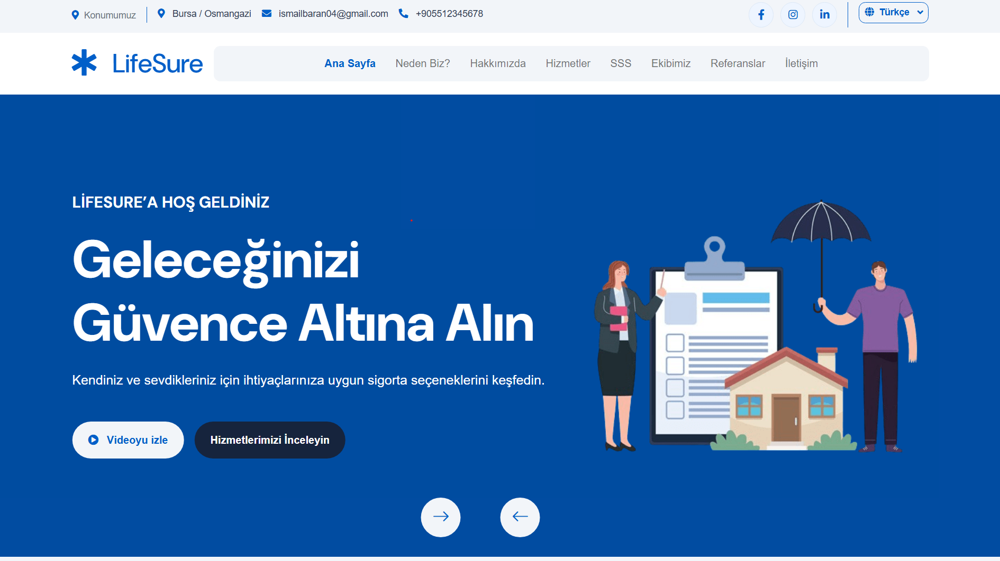

## İçindekiler

- [Özellikler](#özellikler)
- [Teknoloji yığını](#teknoloji-yığını)
- [Mimari ve tasarım kararları](#mimari-ve-tasarım-kararları)
- [CQRS ve MediatR dağılımı](#cqrs-ve-mediatr-dağılımı)
- [Tasarım desenleri](#tasarım-desenleri)
- [Çok dilli içerik](#çok-dilli-içerik)
- [Instagram entegrasyonu](#instagram-entegrasyonu)
- [Kurulum](#kurulum)
- [Proje organizasyonu](#proje-organizasyonu)
- [Ekran görüntüleri](#ekran-görüntüleri)
- [Doğrulama ve çalışma sınırları](#doğrulama-ve-çalışma-sınırları)
- [Geliştirici ve kaynaklar](#geliştirici-ve-kaynaklar)

## Özellikler

### Ziyaretçi arayüzü

- Bölümlere yumuşak kaydırma sağlayan navbar ve mobil menü.
- Veritabanından yönetilen slider ve modal üzerinden video gösterimi.
- Dinamik özellikler, hakkımızda içeriği ve istatistikler.
- Hizmet kartları ve detay metinlerini gösteren popup'lar.
- Sık sorulan sorular, ekip üyeleri ve referans/yorum alanı.
- Türkçe–İngilizce dil seçimi ve dile göre içerik gösterimi.
- Doğrulama ve istek sınırlaması içeren iletişim formu.
- Dinamik iletişim bilgileri, sosyal medya bağlantıları ve footer.
- Instagram'dan alınan son altı gönderinin görselleri; video gönderilerinde kapak görseli.

### Yönetim paneli

- ASP.NET Core Identity ile oturum açma ve Admin rolüyle erişim kontrolü.
- Slider, özellik, hakkımızda, istatistik, hizmet, SSS, ekip ve yorum yönetimi.
- İlgili içeriklerde aktiflik, gösterim sırası ve çeviri yönetimi.
- JPEG, PNG ve WebP görsel yükleme; dosya boyutu ve imza kontrolü.
- İletişim mesajlarını listeleme, görüntüleme ve durumlarını güncelleme.
- Yeni iletişim mesajlarından oluşan bildirimler ve okunma durumu yönetimi.
- Site adı, logo, iletişim bilgileri ve sosyal medya ayarları.

## Teknoloji yığını

| Teknoloji | Kullanım |
| --- | --- |
| .NET 10 / ASP.NET Core MVC | Çalışma zamanı ve web uygulaması |
| Razor / ViewComponent | Sayfa oluşturma ve tekrar kullanılabilir bölümler |
| Entity Framework Core 10 / SQL Server | Veri erişimi, ilişkiler ve migration yönetimi |
| ASP.NET Core Identity | Kullanıcı, rol, parola ve oturum yönetimi |
| MediatR 12.5.0 | İlgili modüllerde request/handler yönlendirmesi |
| Data Annotations ve özel doğrulayıcılar | Girdi doğrulama |
| IStringLocalizer / RESX | Sabit arayüz metinlerinin yerelleştirilmesi |
| IHttpClientFactory / IMemoryCache | HTTP istemcileri ve Instagram önbelleği |
| ASP.NET Core Rate Limiting | İletişim formunda istek sınırlaması |
| Bootstrap, JavaScript ve jQuery | Responsive arayüz ve etkileşimler |
| Apify | Herkese açık Instagram gönderilerinin alınması |

Paket sürümlerinin kaynağı [LifeSure.csproj](LifeSure.csproj) dosyasıdır.

## Mimari ve tasarım kararları

Uygulama, case gereği **tek ASP.NET Core projesi** içerisinde geliştirilmiştir. Sorumluluklar ayrı assembly'ler yerine klasörler, arayüzler ve handler'larla ayrılır. Bu yapı, uygulamanın kapsamına uygun bir organizasyon sağlar ve modüllerin izlenmesini kolaylaştırır.

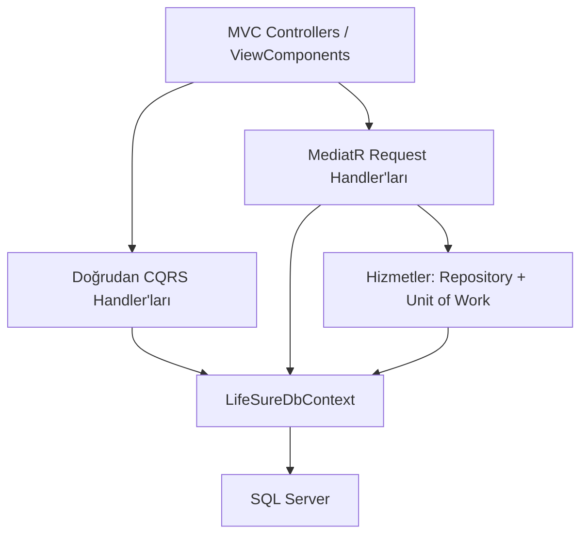

- **Komutlar** veri değiştiren işlemleri, **sorgular** veri okuma işlemlerini temsil eder.
- **ViewComponent'ler**, ana sayfa bölümlerinin veri hazırlama ve görünüm sorumluluklarını ayrı tutar.
- **Translation kayıtları**, yönetilebilir içeriklerin dil varyantlarını saklar.
- **Servis arayüzleri**, görsel saklama ve dış servis erişimini kullanan koddan ayırır.
- **Dependency Injection**, handler, repository ve servislerin yaşam döngülerini yönetir.

## CQRS ve MediatR dağılımı

CQRS bir tasarım yaklaşımı, MediatR ise istekleri handler'lara yönlendiren bir kütüphanedir. Projede iki grup da komut/sorgu ayrımı kullanır; fark, handler çağrılarının doğrudan veya MediatR üzerinden yapılmasıdır.

| Yaklaşım | Modüller | Somut iş entity sayısı |
| --- | --- | ---: |
| Doğrudan CQRS | Slider, Feature, About, Statistic, Faq ve Translation entity'leri | 10 |
| MediatR üzerinden komut/sorgu | Service, TeamMember, Testimonial, SiteSetting ve Translation entity'leri; ContactMessage, Notification | 10 |

Sayım **20 somut iş entity'sini** kapsar. Soyut temel sınıflar ve Identity altyapı tabloları dahil değildir. Çeviriler, bağlı oldukları içeriğin handler akışı içerisinde yönetilir.

İlgili kod: [CQRS/Abstractions](CQRS/Abstractions), [Mediator](Mediator).

## Tasarım desenleri

### Unit of Work — hizmet yönetimi

Hizmet ekleme, güncelleme ve silme komutları `IUnitOfWork` üzerinden çalışır. `IServiceRepository`, hizmet verisine erişimi kapsüllerken `EfUnitOfWork`, aynı DbContext üzerinde biriken değişikliklerin kaydedilmesini sağlar.

Hizmet ve çeviri değişiklikleri hazırlandıktan sonra `SaveChangesAsync` çağrılır. Böylece kayıt noktası komut akışında belirginleşir. Bu uygulama, EF Core'un değişiklik takibi ve kayıt davranışı üzerine kurulu, hizmet modülüyle sınırlı bir soyutlamadır.

İlgili kod: [UnitOfWork](UnitOfWork), [Repositories](Repositories), [Hizmet handler'ları](Mediator/Services/Handlers).

### Observer — iletişim mesajı bildirimleri

İletişim mesajı oluşturulurken `ContactMessagePublisher`, kayıtlı `IContactMessageObserver` uygulamalarını çağırır. `AdminNotificationObserver`, yeni mesaja bağlı bir yönetici bildirimi oluşturur.

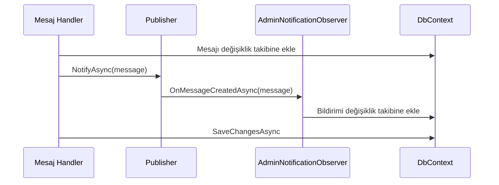

Mesaj ve bildirim aynı DbContext üzerinde, tek `SaveChangesAsync` çağrısıyla kaydedilir. Observer akışı uygulama süreci içinde çalışır; dağıtık mesaj kuyruğu veya SignalR bildirimi değildir.

İlgili kod: [Patterns/Observers](Patterns/Observers).

## Çok dilli içerik

| İçerik türü | Yaklaşım |
| --- | --- |
| Menü, buton, form ve bilgilendirme metinleri | `SharedResource.tr.resx` ve `SharedResource.en.resx` |
| Slider, hizmet ve diğer yönetilebilir metinler | Veritabanındaki Translation kayıtları |
| Dil seçimi | Kültür bilgisini saklayan cookie |
| Desteklenen kültürler | `tr-TR`, `en-US` |
| Varsayılan kültür | `tr-TR` |

Dil değişikliği hazır çeviriler üzerinden yapılır; çalışma anında otomatik çeviri API'sine istek gönderilmez. Dinamik içeriğin İngilizce gösterimi için ilgili alanlar admin panelinden doldurulur. Instagram gönderilerinin özgün metinleri bu çeviri sisteminin parçası değildir.

## Instagram entegrasyonu

Footer, Apify'daki kayıtlı görevin **son başarılı çalıştırmasına** ait sonuçları okur. Ziyaretçi isteği yeni scraping işlemi başlatmaz; yeni veri üretimi Apify zamanlamasının sorumluluğundadır.

| Davranış | Uygulama |
| --- | --- |
| Gönderi kaynağı | `anadolu.sigorta` hesabı için kaydedilmiş Apify görevi |
| Gönderi önbelleği | 30 dakika |
| Başarısız API isteği sonrası yeniden deneme aralığı | 5 dakika |
| Son başarılı gönderi listesinin yedek önbelleği | 24 saat |
| Görsel önbelleği | 30 dakika |
| Başarısız görsel indirmesi önbelleği | 1 dakika |
| Görsel indirme sınırı | 5 MB ve 10 saniye zaman aşımı |

Instagram görsellerindeki CORP/CORS kısıtları nedeniyle tarayıcıya doğrudan CDN adresi verilmez. `/instagram/image/{id}` endpoint'i, mevcut gönderi listesindeki ID'yi çözer ve görseli sunucu üzerinden döndürür. Kaynak adresler HTTPS ve izinli CDN alan adlarıyla sınırlandırılır; otomatik yönlendirme kapalıdır.

Görsel adresleri zamanla geçersizleşebilir. Günlük görevin çalışması, Apify kullanım kotası ve API erişimi entegrasyonun güncelliğini etkiler. Gönderi listesi için yedek önbellek bulunması, uzak görsellerin her koşulda erişilebilir olduğunu garanti etmez.

## Kurulum

### Gereksinimler

- .NET 10 SDK ve çalışan bir SQL Server örneği.
- .NET 10 destekleyen bir IDE veya .NET CLI.
- CLI migration işlemleri için EF Core 10 ile uyumlu `dotnet-ef` aracı.
- Instagram için Apify hesabı, başarılı çalıştırılmış bir Task ve API token.

### 1. Depoyu klonlayın

```bash
git clone https://github.com/ismailbarankarasu/LifeSure.git
cd LifeSure
dotnet restore
```

`LifeSure.csproj` depo kökündedir. Aşağıdaki komutları bu dizinde çalıştırın.

### 2. Yerel yapılandırmayı ekleyin

Visual Studio'da projeye sağ tıklayıp **Manage User Secrets** seçeneğini açın. Aşağıdaki anahtarları kendi değerlerinizle doldurun:

```json
{
  "ConnectionStrings:DefaultConnection": "Server=YOUR_SQL_SERVER;Database=LifeSureDb;Trusted_Connection=True;TrustServerCertificate=True;",
  "SeedAdmin:Email": "admin@example.com",
  "SeedAdmin:Password": "REPLACE_WITH_A_STRONG_UNIQUE_PASSWORD",
  "Instagram:ApifyToken": "YOUR_APIFY_TOKEN",
  "Instagram:TaskId": "YOUR_APIFY_TASK_ID"
}
```

Bağlantı örneği yerel Windows kimlik doğrulaması içindir. SQL kimlik doğrulaması kullanıyorsanız bağlantıyı ortamınıza göre düzenleyin. `TrustServerCertificate=True` yerel geliştirme örneğidir; üretimde sertifika yapılandırmasını ayrıca yapın.

Admin parolası en az **12 karakter**, büyük harf, küçük harf, rakam ve özel karakter içermelidir. Yer tutucuyu gerçek parola olarak kullanmayın.

User Secrets yerel geliştirme içindir ve şifreli bir kasa değildir. Üretimde ortam değişkenleri veya bir secret yöneticisi kullanın. Örnek ortam değişkenleri: `Instagram__ApifyToken`, `ConnectionStrings__DefaultConnection`.

### 3. Veritabanını oluşturun

Mevcut migration'ları uygulayın:

```bash
dotnet ef database update
```

Visual Studio Package Manager Console alternatifi:

```powershell
Update-Database
```

### 4. Yönetici hesabını oluşturun

```bash
dotnet run --launch-profile https -- --SeedAdmin:Enabled=true
```

Bu akış yalnızca Development ortamında çalışır. Admin rolünü ve yapılandırılmış hesabı hazırlar, ardından uygulamayı sonlandırır. Mevcut hesabın parolasını sıfırlamaz. `SeedAdmin:Enabled` değerini kalıcı olarak açık bırakmayın.

### 5. Uygulamayı başlatın

```bash
dotnet run --launch-profile https
```

| Sayfa | Varsayılan yerel adres |
| --- | --- |
| Ziyaretçi arayüzü | `https://localhost:7154` |
| Admin girişi | `https://localhost:7154/Admin/Account/Login` |

Adresler [launchSettings.json](Properties/launchSettings.json) dosyasından gelir. Gerekirse yerel HTTPS sertifikası için `dotnet dev-certs https --trust` komutunu kullanın. Admin oturum cookie'si HTTPS gerektirir.

İçerikleri admin panelinden ekleyin. Migration'lar şemayı oluşturur; geliştirme sırasında girilen örnek kayıtlar ve yerel SQL veritabanı klonlama ile taşınmaz.

### 6. Apify görevini yapılandırın

1. [Instagram Post Scraper](https://apify.com/apify/instagram-post-scraper) üzerinde aşağıdaki input'u kullanın.
2. Ayarları `lifesure-instagram` isimli bir Task olarak kaydedin.
3. Task içinden bir kez çalıştırıp başarılı sonuç aldığınızı doğrulayın.
4. Task ID ve kişisel API token değerlerini User Secrets'a ekleyin.
5. Günlük çalıştırma için `Europe/Istanbul` saat diliminde `0 9 * * *` zamanlaması oluşturup etkinleştirin.

```json
{
  "username": ["anadolu.sigorta"],
  "resultsLimit": 6,
  "skipPinnedPosts": true,
  "dataDetailLevel": "basicData"
}
```

Bu ayar sabitlenmiş gönderileri atlar. Sonuçlar `displayUrl`, `url` ve `id` alanlarını içermelidir. Apify kullanımı sağlayıcının kotasına ve fiyatlandırmasına tabidir. Token'ı istemci JavaScript'ine, ekran görüntülerine veya depoya eklemeyin.

## Proje organizasyonu

| Konum | Sorumluluk |
| --- | --- |
| `Areas/Admin` | Admin controller, model ve görünümleri |
| `Controllers` | Ziyaretçi, dil, iletişim ve Instagram endpoint'leri |
| `CQRS` | Doğrudan çağrılan komut/sorgu handler'ları ve sözleşmeler |
| `Mediator` | MediatR üzerinden çalışan modüller |
| `Data` | DbContext, model yapılandırması ve admin hesabı oluşturma |
| `Entities` | İş entity'leri ve çeviri modelleri |
| `Enums` | Enum tanımları; mevcut yapıda Statistic modelleri de burada bulunur |
| `Repositories` / `UnitOfWork` | Hizmet yönetiminde veri erişimi ve kayıt koordinasyonu |
| `Patterns/Observers` | İletişim mesajı–bildirim akışı |
| `Services` | Görsel saklama, site ayarları ve Instagram servisleri |
| `Resources` | Türkçe ve İngilizce arayüz kaynakları |
| `ViewComponents` / `Views` | Sayfa bileşenleri ve Razor görünümleri |
| `Migrations` | Veritabanı şema değişiklikleri |
| `wwwroot` | Statik dosyalar, template ve yüklenen görseller |

## Ekran görüntüleri

Görselleri depo kökünde **`docs/images`** klasörüne aşağıdaki adlarla ekleyin. Dosyalar GitHub'a gönderildiğinde README içerisinde görüntülenir. Büyük/küçük harf ve uzantı eşleşmesine dikkat edin. Görseller eklenene kadar bu alanlarda kırık görsel bağlantıları görülebilir.

| Dosya | İçerik |
| --- | --- |
| `home.png` | Ana sayfa ve slider; README'nin üstünde gösterilir |
| `about-features.png` | Özellikler, hakkımızda ve istatistikler |
| `services.png` | Hizmet kartları |
| `service-detail.png` | Hizmet detay popup'ı |
| `team-testimonials.png` | Ekip ve referanslar |
| `contact-instagram.png` | İletişim ve Instagram footer alanı |
| `home-en.png` | İngilizce arayüz |
| `admin-dashboard.png` | Yönetim paneli ana sayfası |
| `admin-services.png` | Hizmet yönetimi |
| `admin-content-form.png` | Türkçe–İngilizce içerik düzenleme |
| `admin-messages.png` | İletişim mesajları |
| `admin-notifications.png` | Bildirimler |
| `admin-settings.png` | Site ayarları |

### Özellikler ve hakkımızda

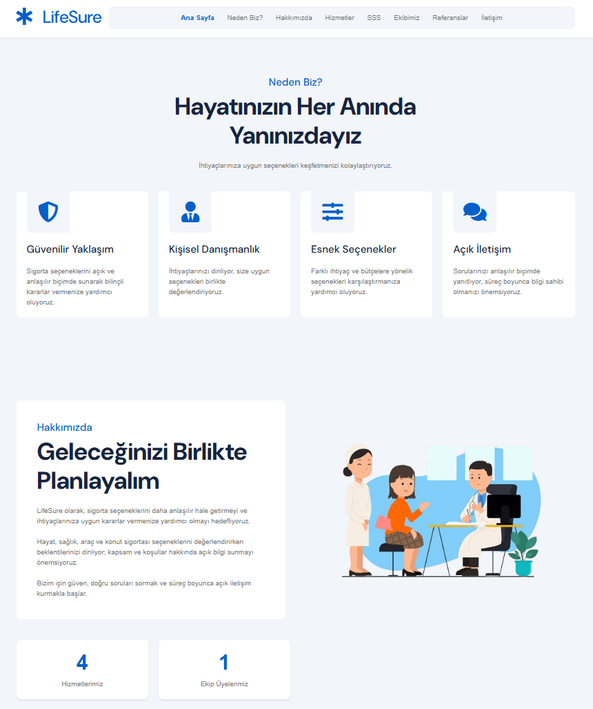

### Hizmetler

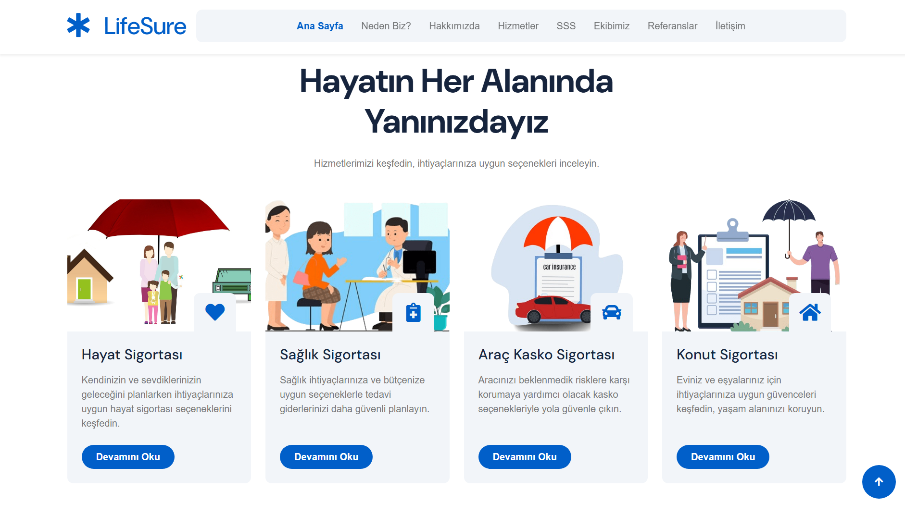

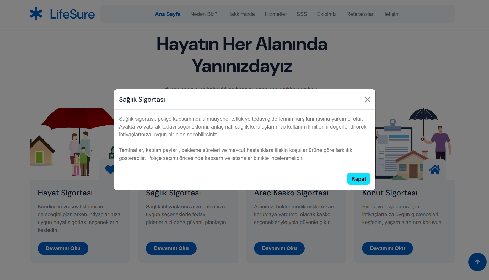

### Ekip ve referanslar

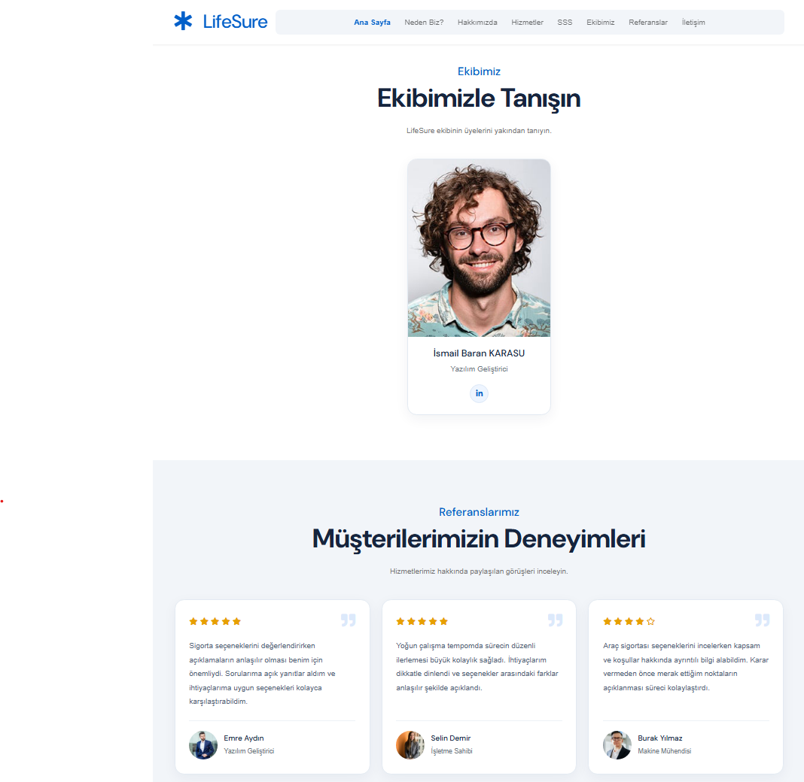

### İletişim ve Instagram

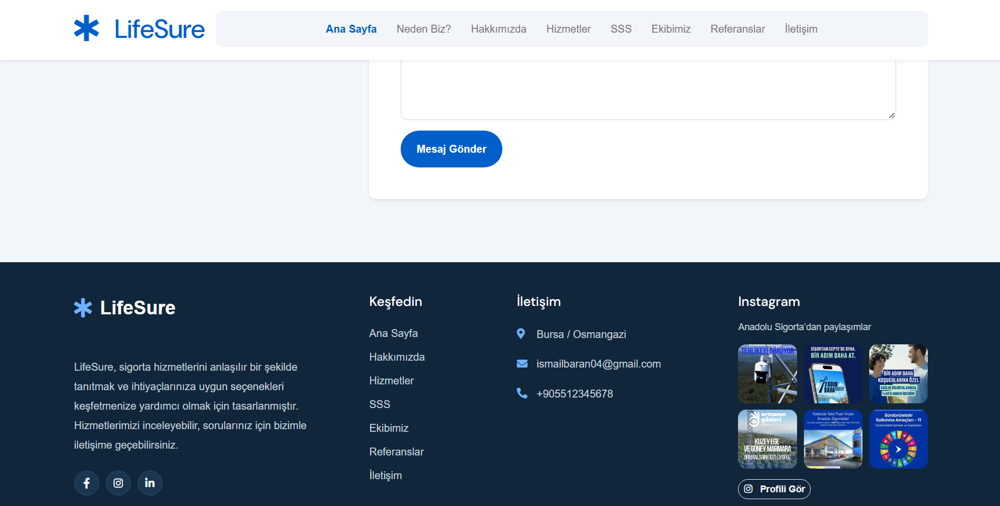

### İngilizce arayüz

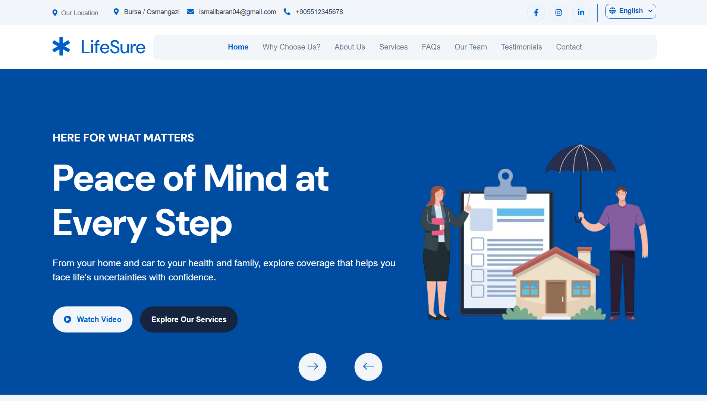

### Yönetim paneli

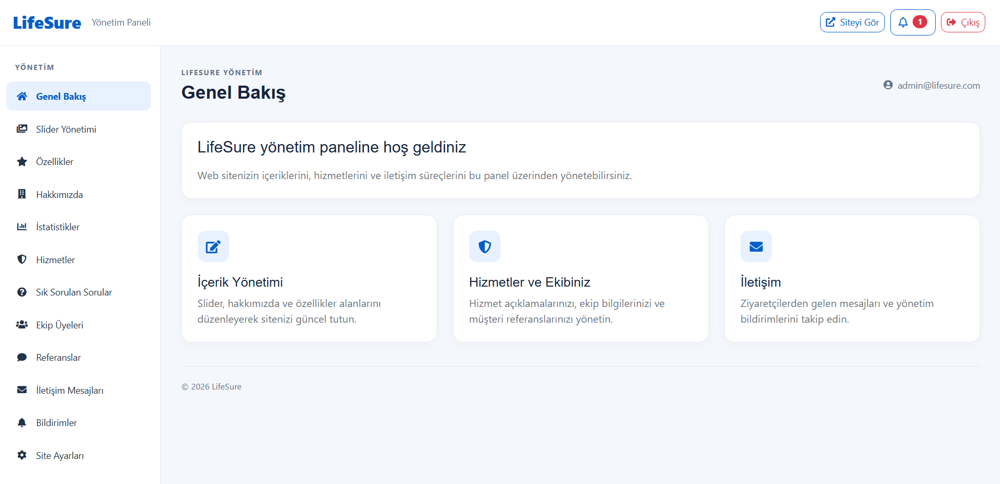

<details>
<summary>İçerik yönetimi ekranları</summary>

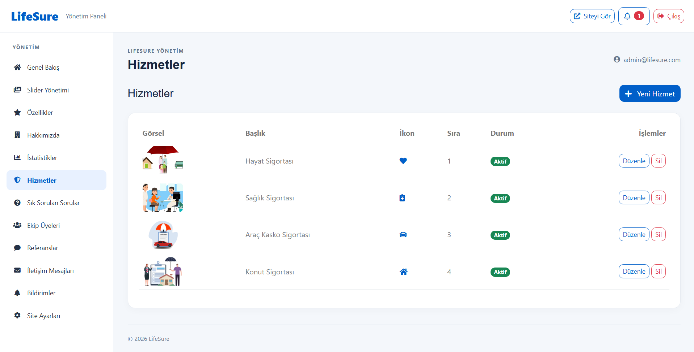

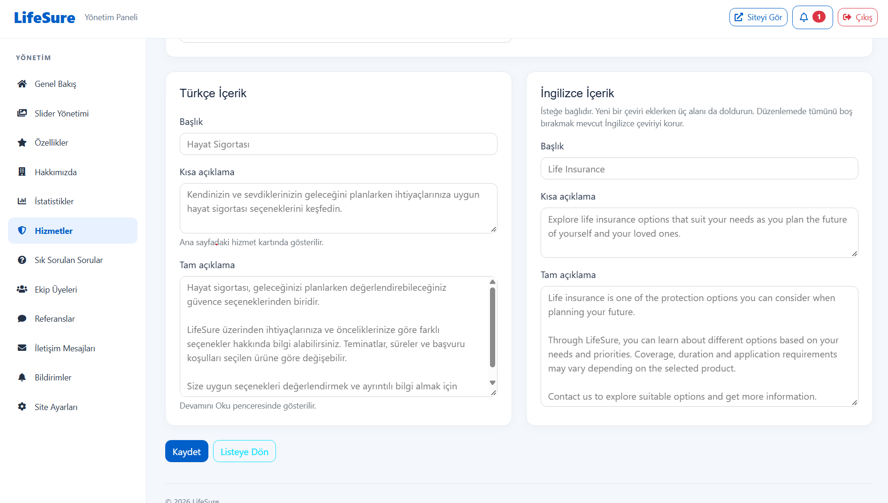

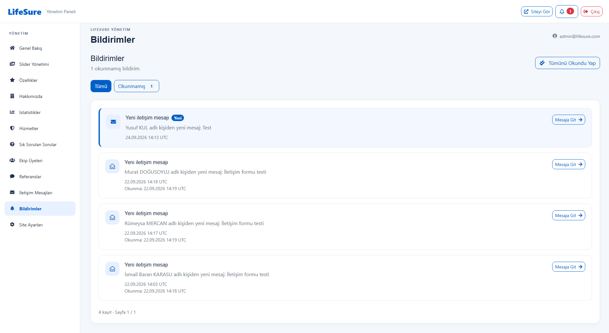

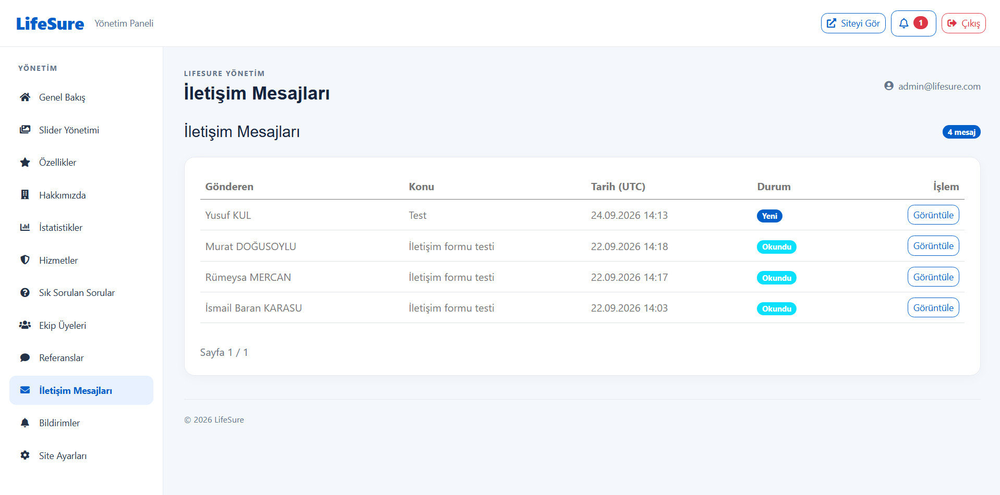

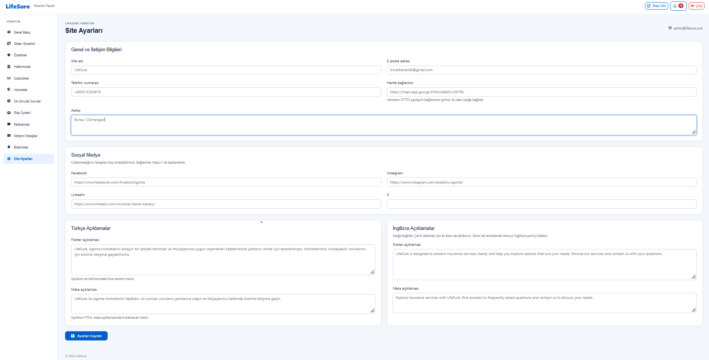

</details>

## Doğrulama ve çalışma sınırları

### Uygulanan kontroller

- Admin rolü üzerinden yönetim alanı yetkilendirmesi.
- HttpOnly, Secure ve SameSite ayarlarıyla oturum cookie'si.
- Beş başarısız giriş denemesinde 15 dakikalık hesap kilitleme yapılandırması.
- İlgili POST işlemlerinde antiforgery doğrulaması ve sunucu tarafı girdi kontrolü.
- İletişim formunda IP başına dakikada üç istek sınırı.
- Yüklenen görsellerde 5 MB sınırı, uzantı ve dosya imzası kontrolü.
- Instagram görsellerinde gönderi ID'si doğrulaması, kaynak alan adı kısıtı ve sınırlı indirme.

### Yerel kontrol akışı

```bash
dotnet build
```

İşlevsel doğrulamada admin oturumu, içerik CRUD işlemleri, TR/EN geçişi, hizmet ve video popup'ları, iletişim mesajı–bildirim ilişkisi ve Instagram görselleri kontrol edilir. Depoda ayrı bir otomatik test projesi bulunmadığından otomatik test kapsamı veya CI başarısı iddiasında bulunulmaz.

### Çalışma sınırları

- Önbellek uygulama belleğindedir; yeniden başlatmada temizlenir ve birden fazla uygulama örneği arasında paylaşılmaz.
- Yüklenen görseller yerel `wwwroot/uploads/images` dizinindedir; dağıtımda kalıcı depolama ve yedekleme planlanmalıdır.
- Instagram API veya görsel sunucusu erişilemediğinde ilgili alan sınırlı/boş kalabilir.
- Bildirimler veritabanına kaydedilir; gerçek zamanlı push ve otomatik e-posta gönderimi uygulanmaz.
- İletişim mesajını “yanıtlandı” olarak işaretlemek tek başına e-posta göndermez.
- Örnek sigorta içerikleri ve demo yorumlar eğitim amaçlıdır; gerçek poliçe teklifi veya müşteri beyanı değildir.

## Geliştirici ve kaynaklar

**İsmail Baran KARASU**

- [GitHub](https://github.com/ismailbarankarasu)
- [LinkedIn](https://www.linkedin.com/in/ismail-baran-karasu/)
- [Proje deposu](https://github.com/ismailbarankarasu/LifeSure)

**Mentör:** Murat Yücedağ — M&Y Yazılım Eğitim Akademi Danışmanlık.

Arayüzün başlangıç noktası HTML Codex tarafından hazırlanan, ThemeWagon üzerinden dağıtılan LifeSure template'idir. Template ve üçüncü taraf varlıkların kullanım koşulları kendi lisanslarına tabidir; [template lisans dosyasını](wwwroot/LifeSure-1.0.0/LICENSE.txt) inceleyin.

Instagram alanındaki gönderiler Anadolu Sigorta'nın herkese açık hesabından alınır. LifeSure bir eğitim projesidir; Anadolu Sigorta ile resmî bir bağlantı veya iş ortaklığı iddiası taşımaz.
